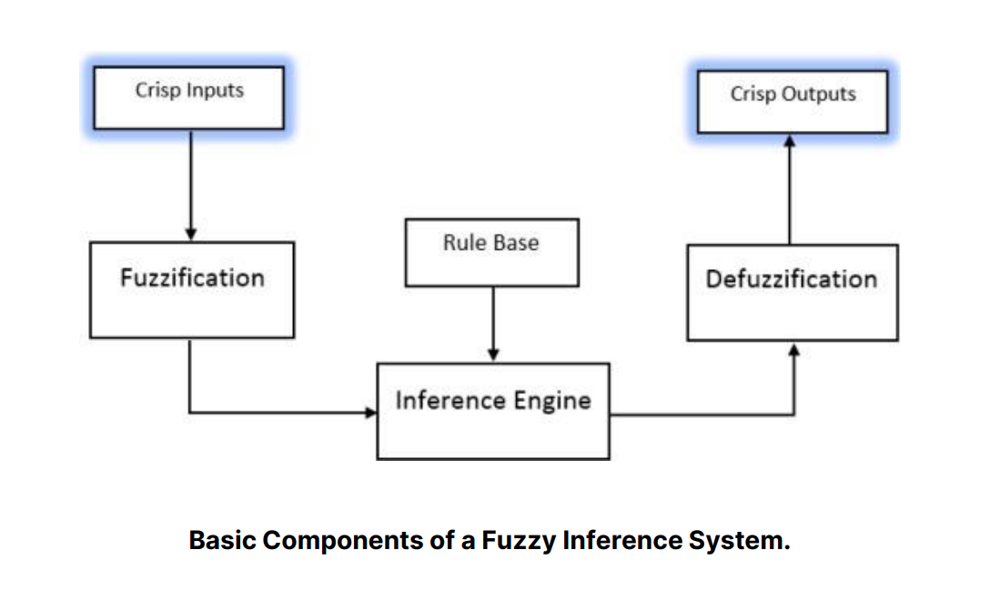
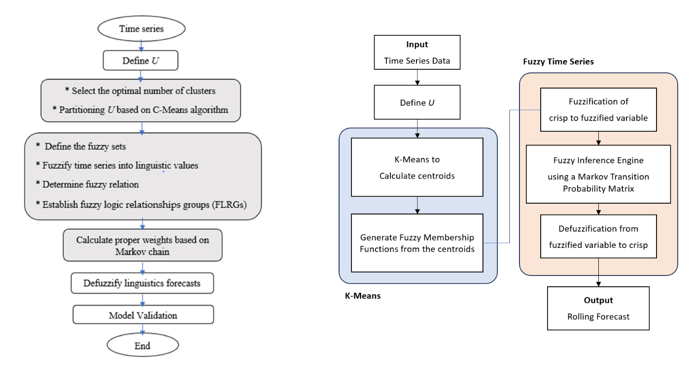
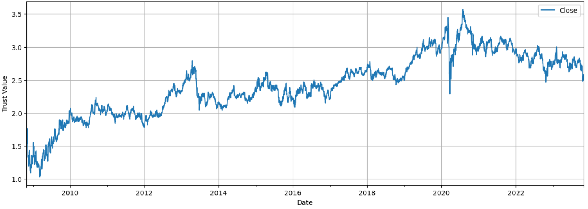
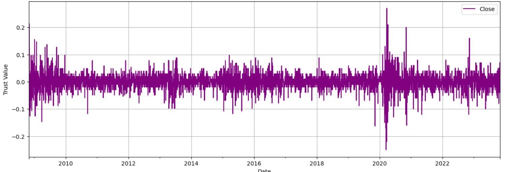
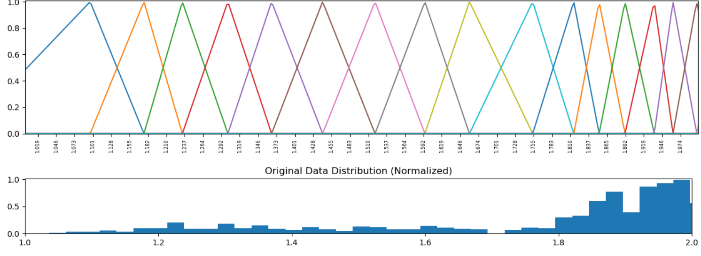
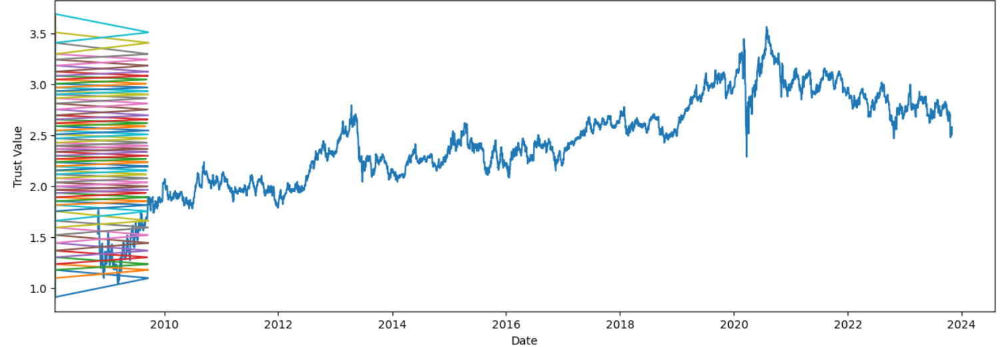

---

##### Download

+ [Slides](slides.pdf)
+ [Code and Data](https://github.com/reinbugnot/kmeans-fuzzy-ts-forecast/tree/main)

---



---

## K-Means Fuzzy Time Series Forecasting (KM-FTS)

The K-Means Fuzzy hybrid model consists of two (quite obvious) parts: (1) a **K-Means clustering** algorithm that identifies the positions of the centroids of the data distribution along the vertical axis and (2) a **Fuzzy** Time Series Forecasting model that utilizes a Fuzzy Inference Engine from dynamically generated triangular membership functions based on the positions of the centroids generated by the clustering algorithm.

This implementation is largely derived from the C-Means Fuzzy Time Series Forecasting hybrid model introduced by Alyousifi, et. al. in their paper "[A new hybrid fuzzy time series model with an application to predict PM10 concentration](https://www.sciencedirect.com/science/article/pii/S0147651321009878)". C-Means Fuzzy or Fuzzy C-means is a clustering strategy that extends the traditional K-Means algorithm to accommodate fuzzy membership values. Unlike K-Means, where each data point belongs to only one cluster with a membership degree of 1, Fuzzy C-Means allows data points to belong to multiple clusters simultaneously with varying degrees of membership [8].

Following the work of Alyousifi, et. al., however, I noticed that although the hybrid model primarily deals with fuzzy systems, the purpose that the clustering algorithm fulfills in the hybrid architecture (namely, finding centroid positions) does not require a fuzzy implementation. That is, regardless of whether each data point belongs to one or more cluster (and by extension, the corresponding centroid) the calculation of the centroid positions remains largely the same. Hence, in order to simplify the process, a standard K-Means clustering algorithm should suffice in identifying centroid positions that will later be used for dynamic partitioning. Shown below is a high-level overview of the model architecture implemented in the study.



*<p style="text-align:center; font-size: 16px"> C-Means Fuzzy Time Series Model Flowchart (Alyousifi, et. al. Implementation) (left) and My Implementation (right) </p>*

Unlike most other traditional forecasting models, FTS-based models such as the hybrid model proposed by the reference study primarily models the non-stationary form of the input time-series data (shown by the lack of differencing step in Fig. 3). That means the model training itself accounts for the trend and seasonalities embedded within the series. While these kinds of models are definitely capable of producing forecasts with high performance and reliability, one known drawback of not using stationary data is that it limits the forecasting range of the model to only within the "[Universe of discourse](https://www.researchgate.net/figure/Universe-of-discourse-error-fuzzy-sets_fig1_221785971)" to which the model was trained on.

### Data

The dataset that I used in this project is the [CapitaLand Ascendas Real Estate Investment Trust](https://finance.yahoo.com/quote/A17U.SI/?p=A17U.SI&.tsrc=fin-srch) (REIT) (A17U.SI) because the timeseries features a wide data range for training and testing (more than 15-years span with daily resolution), relatively stable trend, and noticeable seasonal artifacts. To load the dataset, the .csv file was downloaded directly from Yahoo! Finance, and imported using Pandas.

The dataset features 6 value columns: Open, High, Low, Close, Adj Close and Volume. For this timeseries forecasting project, we are only concerned about the closing price of the trust. Using pandas, we can isolate this target column, and set the Date column as the index of the series. Converting the index into the standard DateTime format of Pandas, we see below that several NaN values appear.

```Python
# Isolate Target Columns
df = data.loc[:, ['Date', 'Close']]
df.set_index('Date', inplace=True)

# Set to date-time index
df.index = pd.to_datetime(df.index)
df = df.asfreq('D')
df
```


These NaN values (which stands for "not-a-number") refers to non-numerical entries, which in this case, specifically identifies 'gaps' or empty entries in our series. Inspecting this further, we can easily identify the pattern and conclude that these gaps correspond to weekends and holidays. This is because the market is closed during weekends and holidays (situational). There are many ways to deal with gaps in our time series. One of the simplest (and effective) way is to perform a *forward fill*. This process basically fills in the gaps / missing entries with the value of the last observed entry. In the case of weekends, the forward fill function will use the Friday's closing date as a proxy value for the 'closing date of weekend days'.

```Python
# Default option: use last observed data point
df.fillna(method='ffill', inplace=True)
```

We can then plot the entire time series data as shown in Fig. 1.



*<p style="text-align:center; font-size: 16px"> Fig. 1. CapitaLand Ascendas REIT Trust closing price data used in this forecasting project </p>*

Most time series forecasting methods utilize the stationary form of the training dataset. A stationary time series is one whose statistical properties, such as mean, variance, and autocorrelation, do not change over time. In other words, the data points in a stationary time series are not dependent on time, and the series has a stable, constant behavior. Stationarity is an important concept in time series analysis because many time series models and statistical methods assume or work better with stationary data. Non-stationary time series can exhibit trends, seasonality, or other patterns that can make it challenging to analyze and model the underlying processes.

In order to derive the first order stationary form of a time series data, we need to calculate the difference between succeeding entries. We can easily do this using the .diff() function of a Pandas Dataframe, as shown in Fig. 2.

```Python
#Convert 
df.diff().plot(title='Fig. 2. First Order Differencing', ylabel='Trust Value',figsize=(15,5), grid=True, color='purple')
plt.show()
```

However, the forecasting strategy implemented in this project, does not require the use of stationary data to perform excellently (although it does introduce notable limitations), as I'll be demonstrating and discussing in the later sections of this project.


*<p style="text-align:center; font-size: 16px"> Fig. 2. Stationary Form of the CapitaLand Ascendas REIT Trust closing price data</p>*


---

### Generate Fuzzy Membership Functions

We begin by defining the model parameters--in this case, just one: n_partitions which also refers to the number of centroids that we expect the K-Means algorithm to generate.

```Python
## MODEL PARAMETERS
n_partitions = 50 # OR the 'k' in our k-means algorithm

## INPUT SERIES PARAMETERS

# TEST SIZE
n_days = 365

# TRAIN-TEST SPLIT (Train on first 14 years, test on last 1 year)
train = df.values.reshape(-1,)[:-n_days * 1]
test = df.values.reshape(-1,)[-n_days * 1:]
```

Afterwards, the code below are simple helper functions for (1) implementing k-means clustering to find the centroid positions, and for (2) generating the set of fuzzy membership functions.

```Python
# This allows us to package our membership functions into objects rather than storing the values directly in memory
class fuzzymf(object):
    def __init__(self, Type, Parameters):
        self.Type = Type
        self.Parameters = Parameters
    def __repr__(self):
            return 'fismf, '\
                ' Type: %s, '\
                ' Parameters: %s\n'\
                % (self.Type,self.Parameters)
```

```Python
def get_centroids(x, method, PAD_RATIO = 0.05, n_partitions=None):
    
    """
    Get the centroid values for the FTS model based on the selected method.
    
    args:
        x - time series data
        method - the method used to generate centroids:
            'grid': generate evenly spaces centroids across the range of values
            'kmeans': perform kmeans clustering algorithm to dynamically identify the best centroid positions based on data distribution
        PAD_RATIO - extend the left half of the left most membership function, and right half of the rightmost membership function by this amount
        n_partitions - number of partitions / number of centroids
    
    out:
        centroids - list of centroids
        (min_val, max_val) - minimum and maximum value of the entire rangne 
    """
    
    assert method in ['kmeans', 'grid']
    
    val_range = max(x) - min(x)
    min_val = min(x) - (val_range * PAD_RATIO)
    max_val = max(x) + (val_range * PAD_RATIO)
    
    #pad_min, pad_max = (min(x) - partition_len * max(x), max(x) * (1 + partition_len))

    # UNIFORMLY DISTRIBUTED CENTROIDS
    if method == 'grid':
        assert n_partitions != None, 'Please specify n_partitions'
        centroids = np.linspace(min_val, max_val, n_partitions+1, endpoint = False)
        centroids = centroids[1:]
    # KMEANS CENTROIDS
    elif method == 'kmeans':
        assert n_partitions != None, 'Please specify n_partitions'
        _, centroids = kmeans1d.cluster(x, n_partitions)
    else:
        print('Invalid method')
    
    return centroids, (min_val, max_val)
```

```Python
def span_learnmf(x, method, n_partitions = None):
    
    """
    Generate a set of fuzzy membership function objects (dict).
    
    args:
        x - time series data
        method - the method used to generate centroids (passed to get_centroids function):
            'grid': generate evenly spaces centroids across the range of values
            'kmeans': perform kmeans clustering algorithm to dynamically identify the best centroid positions based on data distribution
        n_partitions - number of partitions / number of centroids (passed to get_centroids function).
        
    out:
        mf - set 
    """
    
    centroids, (min_val, max_val) = get_centroids(x, method = method, n_partitions=n_partitions)
    
    mf={}
    for idx, centroid in enumerate(centroids):
        if idx == 0:
            mf[idx] = fuzzymf(Type = 'trimf', Parameters = [min_val, centroid, centroids[idx+1]])
        elif idx == len(centroids) - 1:
            mf[idx] = fuzzymf(Type = 'trimf', Parameters = [centroids[idx-1], centroid, max_val])
        else:
            mf[idx] = fuzzymf(Type = 'trimf', Parameters = [centroids[idx-1], centroid, centroids[idx+1]])
            
    return mf, (min_val, max_val), centroids
```

Using the fuzzymf class, we can then generate a set of N triangular membership functions where N = n_partitions [3]. Each triangular membership function requires 3 positional parameters ```[a,b,c]``` that defines the position of the left triangle leg, the triangle apex, and the right triangle leg, respectively. In this implementation, the values of a, b, and c are generally defined as follows: <br>

*a* - centroid value of the previous membership function <br>
*b* - centroid value of the current membership function <br>
*c* - centroid value of the next membership function <br>

For the membership functions in the extremities of the set (i.e., the leftmost and rightmost membership functions), the *a* and *c* value is defined by a padding ratio parameter ```PAD_RATIO``` applied to the min and max values of the universe of discourse U, respectively.

These centroid values are calculated using a 1-dimensional K-Means clustering algorithm that clusters the datapoints based on their distribution (histogram), the output of which is illustrated in Fig. 3. 

```Python

# Generate Membership Functions using K-Means
fuzzy_set, (min_val, max_val), centroids = span_learnmf(train, 'kmeans', n_partitions=n_partitions)

fig, ax = plt.subplots(nrows=1, ncols=1, figsize=[15,3])
for c in centroids:
    ax.axvline(c, color='r',linestyle='--')
ax.hist(train, bins=100)
plt.xlabel('Trust Value')
plt.ylabel('Count')
plt.show()
```


*<p style="text-align:center; font-size: 16px"> Fig. 3. Datapoint Distribution and Calculated Centroid Positions</p>*


Using the calculated centroids, we can then generate a set of membership functions, a snippet of which is illustrated in Fig. 4.

From the figure shown, we can get an idea of how the K-Means clustering algorithm influences the distribution of membership centroid values. We can see how the membership values somehow cluster tightly in areas where the data distribution is high, and loosely in areas where the data distribution is low. This is the main strength of using a clustering algorithm like (1-dimensional) K-means is that it allows us to assign more centroids in areas where the concentration of data points is high. This allows us to increase the granularity of our inferencing system in areas where it is most needed.


```Python
# Plot Membership Functions
fig, ax = plt.subplots(nrows=1, ncols=1, figsize=[15,3])
for i in range(len(fuzzy_set)):
    x = np.linspace(min_val, max_val, (n_partitions+1)*20, endpoint = False)
    ax.plot(x, evalmf(fuzzy_set[i], x), label='Winning Vector 1')
    ax.set_xticks(x[::10])
    ax.set_xlim([1,2])
    ax.set_ylim([0,1.01])
    ax.tick_params(axis='x', rotation=90, labelsize=6)
    
plt.figure(figsize=(15,1.25))
plt.hist(train, density=True, bins=100)
plt.xlim([1,2])
plt.ylim([0,1.01])
plt.show()

plt.tight_layout()
```


*<p style="text-align:center; font-size: 16px"> Fig. 4. Triangle Membership Functions from K-Means Centroids \n (Zoomed in to the range of 1 to 2)</p>*

We can plot all N membership functions on top of the original time series data to visualize how the membership functions interact with the original data that it is derived from, as shown in Fig. 5.

```Python
# Plot Generated Membership Functions
x = np.linspace(min_val, max_val, (n_partitions+1)*20, endpoint = False)

fig, ax = plt.subplots(figsize=(15,5))
ax.plot(df.index, df.values)
ax.set_ylabel('Trust Value')
ax.set_xlabel('Date')

## Uncomment this if we want to zoom in on a particular y value range
# ax.set_ylim([2,2.5])

ax2 = ax.twiny()
for i in range(len(fuzzy_set)):
    ax2.plot(evalmf(fuzzy_set[i], x), x, label='Winning Vector 1')
    ax2.set_xlim([0,10])
    ax2.set_xticks([])
plt.show()
```


*<p style="text-align:center; font-size: 16px"> Fig. 5. A17U.SI Time Series with the Kmeans-generated fuzzy membership functions</p>*

**<p style="text-align:center"> TO BE CONTINUED </p>**


--- 

##### Citation

[1] Y. Alyousifi, M. Othman and A. A. Almohammedi, "A Novel Stochastic Fuzzy Time Series Forecasting Model Based on a New Partition Method," in IEEE Access, 2021 <br>
[2] Alyousifi, Yousif & Mahmod, Othman & Husin, Abdullah & Rathnayake, Upaka. A new hybrid fuzzy time series model with an application to predict PM10 concentration. Ecotoxicology and Environmental SafetY, 2021 <br>
[3] A. Kai Keng, Fuzzy Memberships, AI6124 Assignment 3, Nanyang Technological University, 2023. <br>
[4] A. Kai Keng, POPFNN, AI6124 Assignment 4, Nanyang Technological University, 2023. <br>
[5] W. Di, Week 5: Clustering, AI6124 Lecture Slides, Nanyang Technological University, 2023. <br> 
[6] W. Di, Week 4 - Part 1: Fuzzy Set, Fuzzy Logic, Fuzzy Rule Based System, AI6124 Lecture Slides, Nanyang Technological University, 2023. <br>
[7] J. B. Maverick, “How is the exponential moving average (EMA) formula calculated?,” Investopedia, https://www.investopedia.com/ask/answers/122314/what-exponential-moving-average-ema-formula-and-how-ema-calculated.asp (accessed Nov. 22, 2023). [8] A. Gupta, “Fuzzy C-means clustering (FCM) algorithm in Machine Learning,” Medium, https://medium.com/geekculture/fuzzy-c-means-clustering-fcm-algorithm-in-machine-learning-c2e51e586fff (accessed Nov. 22, 2023). <br>

```BibTeX
<!-- @article{UV01,
author = {Detlev A. Unterholzer and Moritz-Maria von Igelfeld},
year = {2001},
title ={Unusual Uses For Olive Oil},
journal = {Journal of Oleic Science},
volume = {34),
number = {1},
pages = {449--489},
url = {http://www.alexandermccallsmith.com/book/unusual-uses-for-olive-oil}} -->
```

---
